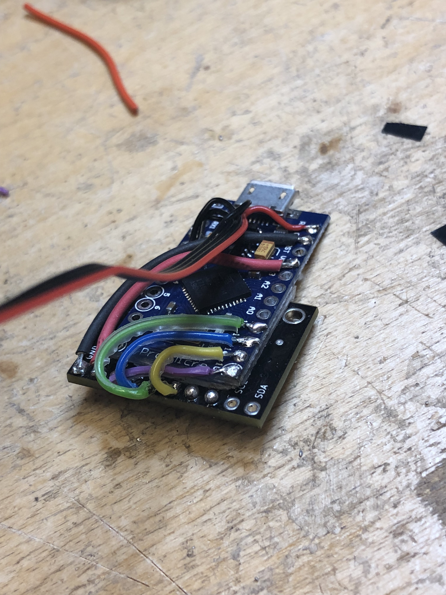

# PX4FLOW replacement using PMW3901 

The PX4FLOW sensor is a commercial plug-and-play sensor for the PX4 flight
stack. This project is a drop-in replacement for the PX4FLOW sensor using
Bitcraze's [Flow Breakout board](https://wiki.bitcraze.io/breakout:flow).

The flow deck's optical flow sensor is the highly-accurate PMW3901, and its ToF
range sensor is VL53L0X. Talking to the PMW3901 is done over SPI, and the
VL53L0X over I2C.

The advantages of PMW3901 are chiefly a) the tiny sensor, b) reliable flow at
any altitude. Please note that the PX4 already has support for the PMW3901!
However, this requires access to the SPI bus which many of the PX4 hardware
implementations do not give (e.g. the PixRacer v4 which we use.) However, if
you have something like the PixHawk, you can just directly connect the breakout
board to the SPI bus.

The sketch provided has disabled the range sensor since its I2C communication 
interrupts the communication with the PX4 flight stack. A better solution is
for the PX4 to query the range sensor directly.

Finally, note that since the flow deck has no IMU, the gyro data is zeroed
out. This means that gyro compensation will _not_ work unless reprogrammed
to use the PX4's main IMU (which I recommend anyhow.) This requires modifying
the Kalman filter in the PX4, contact me for details on how.

## Build the hardware

You need

- [Flow Breakout board](https://wiki.bitcraze.io/breakout:flow)
- Arduino or an Arduino knock-off with both SPI and I2C. Some tiny Arduino
  variants can't do both simultaneously! Watch out for this.
- You'll need a soldering iron, wires, etc.

Solder wires between the SPI pins on the breakout and the Arduino, then solder
a four-pole cable for the I2C bus. Typically, this cable is terminated with a
Hirose DF13 header, or more commonly a JST GH header.

Also connect the breakout's Vcc to the 5 V output of the Arduino. The breakout
board can also use 3.3 V, but the I2C signal levels need to be 5 V.

We did not connect the ToF sensor as it's queried with I2C as well, and reading
it interferred with sending I2C data back to the PX4. If you want to use it,
connect it to the I2C bus and read it from the PX4 directly instead.

